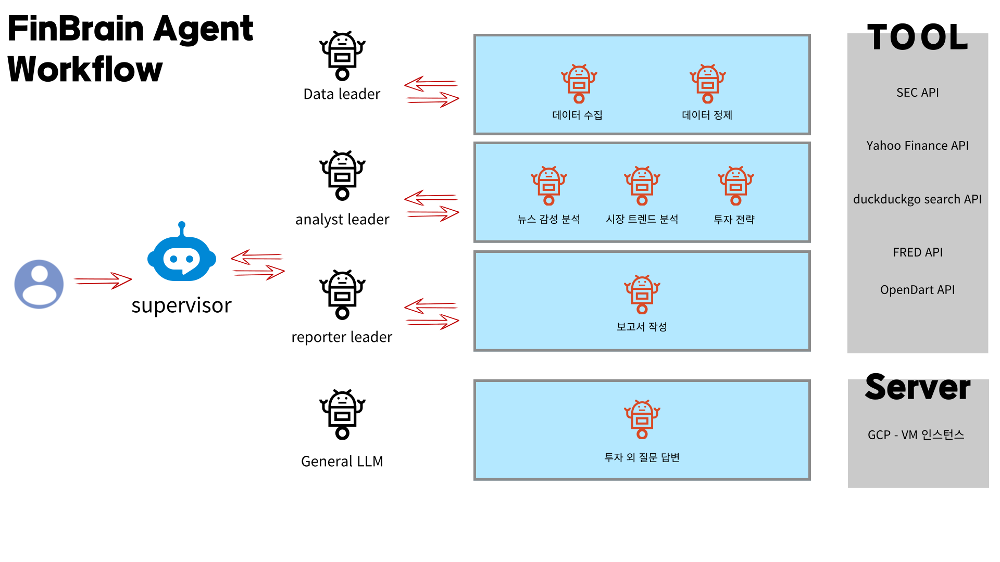

# 1. 요구사항 정의 & 기본 아키텍처 설계
## 1.1. 요구사항

## 1.2 워크플로우

# 2 API 
- Alpha Vantage API 
- Yahoo Finance API 
- MarKetStack API
    - 가격 : 월 100개/하루 33개
    - 제공 : 실시간 주가 데이터/과거 주가데이터 / 거래량 / 환율/ 지수
    - 용도 : 개별 종목 분석 

- FRED API
    - 가격 : 무료
    - 제공 : 거시 경제 
    - 용도 : 경제 분석 / 시장 전망

- IEX Cloud API
    - 접속안됨 

- EastMoney API(스크래핑으로 가져옴 ) 
    - 나라 : 중국 
    - 제공 : 현재/최고/최저/거래량

- GoogleSerperAPIWrapper(type="news")
    - 가격 : 2500크레딧까지 무료, 1credit  뉴스 10개
    - 특징 : 
        - title / link / snippet 리턴 - > 자세한 내용은 링크로 들어가서 파싱해야함함
        - 뉴스 출처(사이트)가 다양함, but 블룸버그 뉴스는 구독해야 내용 볼 수 있음
        - 사이트 다양함 -> 사이트 별 HTML 구조 다름
