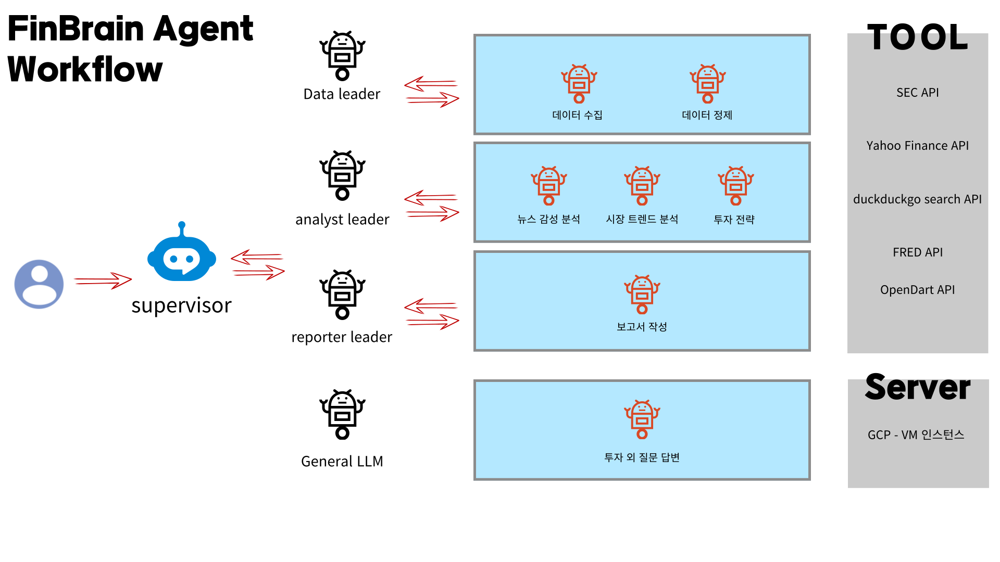

# 1. 요구사항 정의 & 기본 아키텍처 설계
## 1.1. 요구사항

## 1.2 워크플로우

## 1.3 Agent
### 1.3.1 Data Cleansing Agent
#### Tool
1. 불필요한 데이터 제거 : 중복/오류/무의미한 값 삭제
    - 예) 여러 API에서 같은 데이터 가져왔을 때, 중복 제
    - remove_duplicates: 리스트 내 중복된 항목을 제거
2. 형식 변환 : 날짜 형식 통일, 숫자 단위 변환
    - standardize_dates: 날짜 필드를 YYYY-MM-DD 형식으로 변환.
    - normalize_numbers: 숫자 문자열(예: "1,234", "5.0%")을 부동소수점으로 변환
3. 텍스트 클렌징 : 뉴스/보고서에서 의미 없는 문장 제거
4. 결측치 처리 : 누락 데이터 보완 / 삭제   
    - handle_missing: 누락된 값(None, "N/A")을 기본값으로 대체
5. 데이터 구조 변환 : 비정형 데이터 정형화
    - detect_outliers: 특정 임계값(예: 표준편차 3배)을 초과하는 이상값을 탐지

#### Prompt
1. Step 1: 입력된 데이터 유형을 식별하여 적절한 정제 로직 적용
    - List[str] → 뉴스 데이터
    - List[Dict] → 경제 데이터
2. Step 2: 도구 사용 규칙 정의
    - 모든 데이터에 공통 적용: 중복 제거, 날짜 표준화
    - 숫자 데이터에 추가 적용: 숫자 정규화, 누락값 처리, 이상값 탐지
    - 뉴스 데이터 처리: 금융 관련 뉴스만 필터링

3. Step 3: 논리적 판단
    - 예: 단위 변환 오류 탐지 (USD vs KRW, 백만 vs 십억 등)

4. Step 4: 결과 출력 형식 정의
    - log에는 뭐 포함할지 <- 

---
### 1.3.2 Investment Strategy Agent
#### Tool
1. Risk-Reward Analysis : 시장 데이터 기반 리스크-리워드 분석
    - analyze_risk_reward: 리스크 허용도(risk_tolerance)에 따른 분석 수행
        - 리스크 수준별 최대 손실률 설정 (보수: 5%, 중립: 10%, 공격: 15%)
        - 잠재 수익률 범위 추정
        - 고려할 리스크 요인 식별(시장 변동성, 경제 지표, 섹터별 위험)
        - 예상 수익률 범위 추정 (보수: 3-5%, 중립: 6-10%, 공격: 11-15%)

2. Asset Allocation : 리스크 프로파일과 시장 상황 기반 자산 배분
    - generate_asset_allocation: 리스크 수준별 자산 배분 전략 생성
        - 보수적: 주식 30%, 채권 50%, 현금 15%, 대체투자 5%
        - 중립적: 주식 50%, 채권 30%, 현금 10%, 대체투자 10%
        - 공격적: 주식 70%, 채권 15%, 현금 5%, 대체투자 10%
    - 기본 자산 배분은 중립적으로 설정
    - 리밸런싱 주기는 분기별로 설정
    - 섹터별 가중치 추천 (기술 25%, 헬스케어 20%, 금융 15%, 소비재 15%, 기타 25%)

3. Investment Timeline : 투자 전략 실행 계획 수립
    - create_investment_timeline: 투자 기간별 실행 계획 생성
        - 단기(1-2년): 월간 리밸런싱
        - 중기(3-5년): 분기별 리밸런싱
        - 장기(5년+): 반기별 리밸런싱
    - 타임라인 (초기 투자 계획, 첫 자산 배분, 첫 성과 점검, 포트폴리오 조정 주기)
    - 마일스톤 (포트폴리오 초기 설정, 첫 리밸런싱 실행, 분기별 성과 점검, 연간 전략 재평가)
    - 모니터링 스케줄 (빈도, 평가 기준: 성과, 리스크 수준, 배분 변화량량)

#### Prompt
1. Step 1: 시장 상황 및 리스크 분석
    - 경제 지표 및 시장 동향 평가
    - 리스크 요인 식별 및 정량화
    - 리스크 허용도 수준 결정

2. Step 2: 투자 전략 수립
    - 자산 배분 전략 결정
    - 섹터별 투자 비중 설정
    - 리밸런싱 주기 설정

3. Step 3: 실행 계획 수립
    - 투자 기간 설정
    - 주요 마일스톤 정의
    - 모니터링 지표 선정

4. Step 4: 결과 출력
    - 투자 전략 요약
    - 자산 배분 상세 내역
    - 실행 일정 및 모니터링 계획

# 2 API 
- Alpha Vantage API 
- Yahoo Finance API 
- MarKetStack API
    - 가격 : 월 100개/하루 33개
    - 제공 : 실시간 주가 데이터/과거 주가데이터 / 거래량 / 환율/ 지수
    - 용도 : 개별 종목 분석 

- FRED API
    - 가격 : 무료
    - 제공 : 거시 경제 
    - 용도 : 경제 분석 / 시장 전망

- IEX Cloud API
    - 접속안됨 

- EastMoney API(스크래핑으로 가져옴 ) 
    - 나라 : 중국 
    - 제공 : 현재/최고/최저/거래량

- GoogleSerperAPIWrapper(type="news")
    - 가격 : 2500크레딧까지 무료, 1credit  뉴스 10개
    - 특징 : 
        - title / link / snippet 리턴 - > 자세한 내용은 링크로 들어가서 파싱해야함함
        - 뉴스 출처(사이트)가 다양함, but 블룸버그 뉴스는 구독해야 내용 볼 수 있음
        - 사이트 다양함 -> 사이트 별 HTML 구조 다름
